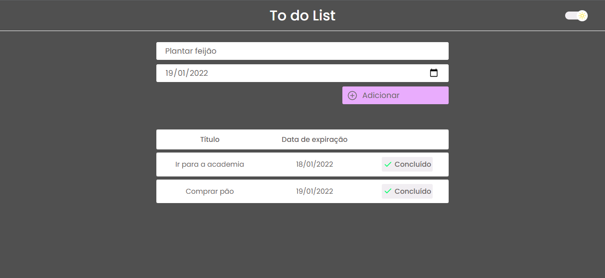

<h1 align="center">To do List</h1>


---

## 🧪 Technologies

<p>This project was developed with the following technologies:</p>

- [React](https://en.reactjs.org/)
- [Typescript](https://www.typescriptlang.org/)

## 🚀 How to run

<p>You can access the project here <a href="https://to-do-list-luisspassos.vercel.app/">https://to-do-list-luisspassos.vercel.app/</a> or:</p>
<p>Clone the project and access its folder.</p>

```bash
$ git clone https://github.com/luisspassos/to-do-list.git
$ cd to-do-list
```

<p>To start it, follow the steps below:</p>

 ```bash
 # Install dependencies
 $ yarn
 
 # Start the project
 $ yarn start
 ```
 <p>The app will be available in your browser at the address <a href="http://localhost:3000">http://localhost:3000</a></p>
 
 ## 💻 Project
 
 <p>This project was developed for me to strengthen my knowledge with React and also served as an entrance to the world of Typescript.</p>
